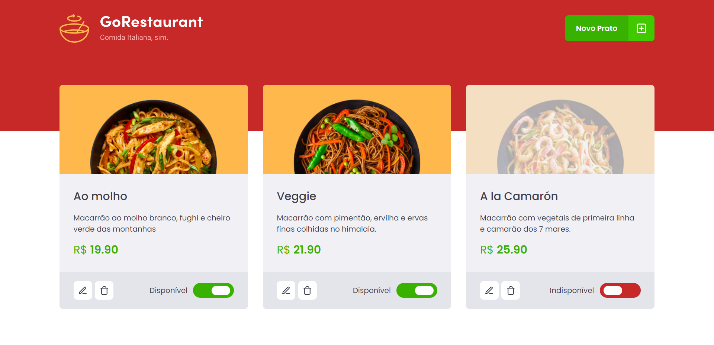

  

  <a href='#about'>📖 Sobre</a>&nbsp;&nbsp;&nbsp;|&nbsp;&nbsp;&nbsp;
  <a href='#technologies'>🔩 Tecnologias</a>

 

  

# 📖 Sobre o Projeto

Este projeto faz parte de uma serie de desafios complementares do curso Ignite da @Rocketseat.

Este desafio tem como objetivo realizar a conversão de um projeto React desenvolvido em class component, para function component utilizando TypeScript.

# 🔩 Tecnologias

Estas foram as principais tecnologias utilizadas no desenvolvimento da aplicação.

- [ReactJS](https://pt-br.reactjs.org/)
- [TypeScript](https://www.typescriptlang.org/)
- [Create React App](https://create-react-app.dev/)
- [Styled Components](https://styled-components.com/)
- [Axios](https://axios-http.com/ptbr/)
- [React Modal](https://reactcommunity.org/react-modal/)
- [React Router](https://reactrouter.com/en/main)
